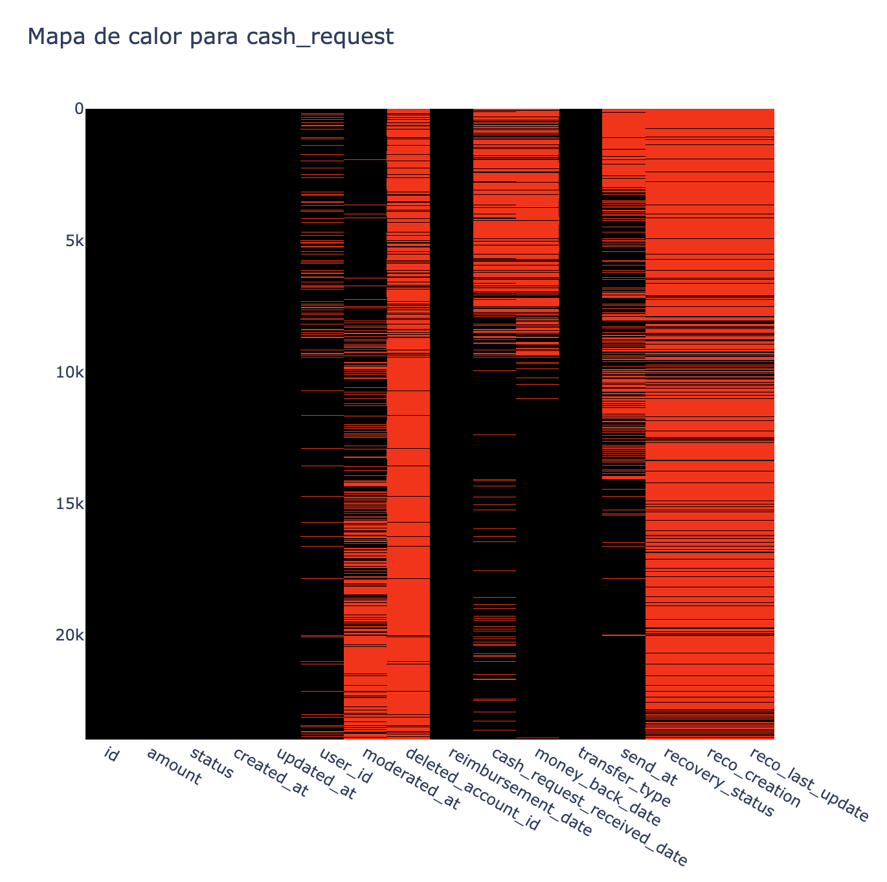
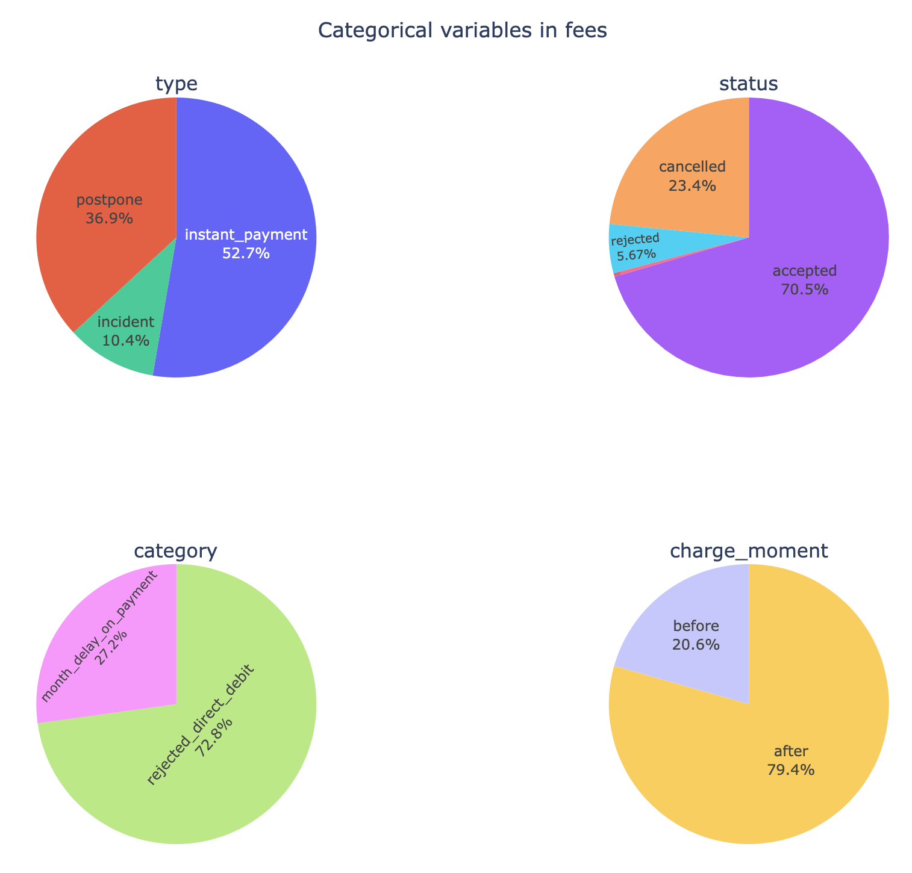

# Business Payments: EDA and Modelling

Resumen ejecutivo para el proyecto final "Análisis de Business Payments" del curso [UOC](https://www.uoc.edu) Data Scientist.

Versión: 1.0

Creado: 4/12/2024

Autores: Montserrat López Ibáñez


## Descripción

Proyecto de análisis de datos, sobre los cuales se aplicará un modelo de regresión regularizado, así como un modelo de clasificación.

Los datos iniciales son dos datasets:
- `cash_request.csv`: Contiene las solicitudes de préstamo.
- `fees.csv`: Contiene las cuotas cobradas 

El excel Lexique-Data_Analyst.xlsx contiene la semántica de los datos.

## Análisis Exploratorio de Datos (EDA)

### Dataset cash_request

El dataset `cash_request` consta de 23.970 filas y 16 columnas, del siguiente tipo:

- **numéricas**: id, amount, user_id, deleted_account_id
- **categóricas**: status, transfer_type, recovery_status
- **datetime**: created_at, updated_at, moderated_at, reimbursement_date, cash_request_received_date, money_back_date, send_at, reco_creation, reco_last_update

Destacaremos la semántica de algunas de estas columnas:

- `id`: identificador de la solicitud de préstamo. Es la columna de enlace con el dataset fees.csv.
- `deleted_account_id`: columna que se pobla cuando el usuario elimina su cuenta.
- `amount`: cantidad solicitada como préstamo.
- `status`: estado del proceso en que se encuentra la solicitud. La ejecución del método value_counts() en esta columna muestra el siguiente resultado:

    ```terminal
    money_back               16397
    rejected                  6568
    direct_debit_rejected      831
    active                      59
    transaction_declined        48
    direct_debit_sent           34
    canceled                    33
    ```

- `transfer_type`: indica el tipo de préstamo solicitado por el usuario, pudiendo ser de tipo instantáneo (el usuario paga una cuota a cambio de que la transferencia sea inmediata) o de tipo regular (el usuario no paga nada y espera el tiempo necesario hasta que la transferencia se hace efectiva).

    ```terminal
    instant    13882
    regular    10088
    ```
- `recovery_status`: indica el estado de los incidentes de pago. Null si no hubo incidentes.

- `moderated_at`: momento en que tuvo lugar una revisión manual de la solicitud.

- `money_back_date`: momento en que el préstamo fue retornado.

### Dataset fees

El dataset `fees` consta de 21.061 filas y 13 columnas, del siguiente tipo:

- **numéricas**: id, cash_request_id, total_amount
- **categóricas**: type, status, category, charge_moment
- **textuales**: reason
- **datetime**: created_at, updated_at, paid_at, from_date, to_date

Destacaremos la semántica de algunas de estas columnas:

- `cash_request_id`: es el identificador que enlaza esta tabla con el dataset cash_request.csv
- `total_amount`: cuota que se le ha cobrado al usuario a cambio de un préstamo de tipo instantáneo, a cambio de un retraso en la devolución del dinero prestado, o a causa de un incidente.
- `type`: tipo de incidente que ha generado el pago de una quota.

    ```terminal
    instant_payment    11099
    postpone            7766
    incident            2196
    ```

- `status`: indica el estado de cobro de la cuota. Cuanto el valor que consta es _accepted_, significa que se cobró con éxito.

    ```terminal
    accepted     14841
    cancelled     4938
    rejected      1194
    confirmed       88
    ```

- `category`: describe el motivo por el cual se cobró una cuota debida a un incidente.

    ```terminal
    rejected_direct_debit     1599
    month_delay_on_payment     597
    ```

- `charge_moment`: momento en que se cargó la cuota siendo _after_ después de haber recibido el préstamo (mayormente préstamos instantáneos, aunque no siempre; también hay incidentes de tipo _postpone_ en que el momento de la cuota es _after_), o bien _before_ cuando la cuota se debe a una solicitud de préstamo regular con algún tipo de incidente.

    ```terminal
    after     16724
    before     4337
    ```

A partir de aquí iniciamos el Análisis Exploratorio de Datos propiamente.

<!-- 3. **Análisis de Calidad de los Datos**: Evaluar la calidad de los datos, identificando problemas como valores faltantes, inconsistencias, errores o duplicados. -->

El análisis de calidad de datos mostró bastantes valores nulos en ambos datasets. Como ejemplo, mostramos el dataset cash_request.



A partir de los mapas de calor de valores nulos, observamos lo siguiente:

- Las columnas `user_id` y `deleted_account_id` son complementarias. De hecho, en un examen más exhaustivo comprobamos que existe 1 fila con valores no nulos tanto en la columna `user_id` como en la columna `deleted_account_id`. No debería darse el caso puesto que la columna `deleted_account_id` sólo tiene valor cuando un usuario ha eliminado su cuenta. ¿Se trata de una cuenta reactivada?
- La columna `moderated_at` presenta bastantes valores no nulos, señal de que ha habido intervención humana en muchas de las solicitudes.
- La columna `category` de fees está mayormente por valores nulos. De hecho, comprobamos que tan sólo hay 2.196 valores distintos de Null en esa columna.

<!-- 1. **Análisis de Series de Tiempo**: Realizar un análisis exhaustivo de las tendencias y patrones temporales presentes en los datos. -->

OBSERVACIONES de las SERIES de TIEMPO

- En el dataset cash_request los `id` **no** están ordenados de forma ascendente, como quizá sería esperable en un sistem automático.

<!-- 2. **Análisis Exploratorio de Datos (EDA)**: Identificar patrones, anomalías y relaciones entre las variables mediante visualizaciones y estadísticas descriptivas. -->
<!-- 4. **Análisis Gráfico de los Datos**: Representar gráficamente las variables mediante gráficos como histogramas, diagramas de dispersión, boxplots, entre otros, para facilitar la comprensión visual de los datos. -->

A continuación mostraremos las columnas categóricas de ambas tablas de forma visual.


Para el dataset cash_request observamos que:

- 
- 



Para el dataset fees observamos que:

- 
- 

<!-- 5. **Segmentación Inteligente de los Datos**: Implementar técnicas de segmentación avanzadas que aporten valor al análisis y la extracción de insights relevantes. -->
<!-- 6. **Análisis de Correlación**: Evaluar las relaciones y asociaciones entre las variables mediante matrices de correlación y análisis de dependencias. -->
<!-- 7. **Análisis de Outliers**: Detectar y tratar los valores atípicos (outliers) presentes en los datos para mejorar la precisión de los modelos. -->
<!-- 8. **Análisis de Cohortes Avanzados**: Realizar segmentación y análisis del comportamiento de los usuarios a lo largo del tiempo, con el objetivo de identificar patrones de retención, uso y otros comportamientos clave. -->
<!-- 9. **Modelos de Regresión Regularizados**: Implementar modelos de regresión regularizados (como Ridge, Lasso, ElasticNet), utilizando técnicas de búsqueda de hiperparámetros para optimizar el rendimiento del modelo. -->
<!-- 10. **Modelos de Clasificación**: Desarrollar y optimizar modelos de clasificación (como árboles de decisión, SVM, k-NN), utilizando los métodos adecuados de validación y evaluación. -->
<!-- 11. **Validación de Modelos**: Seleccionar los mejores modelos mediante validación cruzada con k-fold, para asegurar la robustez y generalización de los modelos creados. -->
<!-- 12. **Uso de Scraping para Variables Exógenas**: El proyecto debe incluir el uso de técnicas de web scraping para obtener variables adicionales de fuentes externas que aporten valor a los datos originales del proyecto. -->


